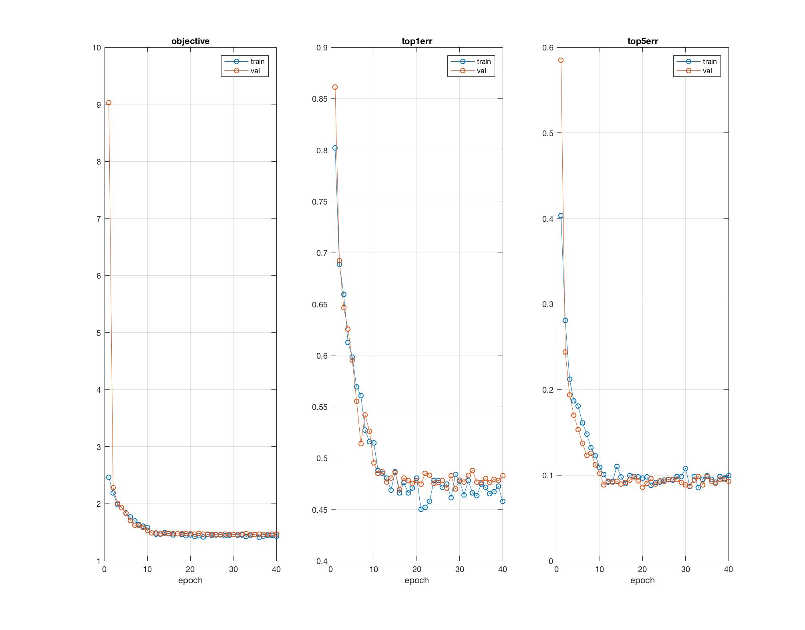
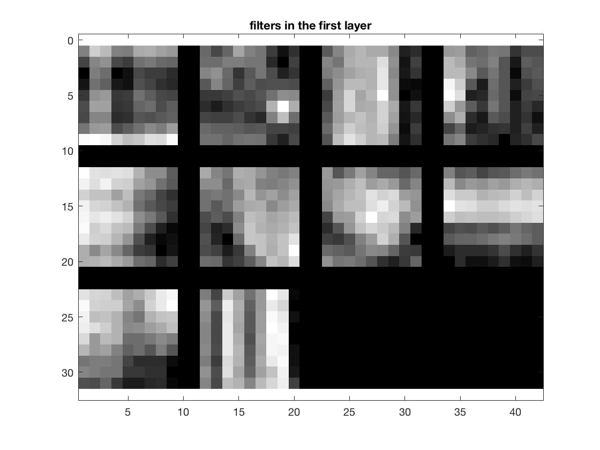
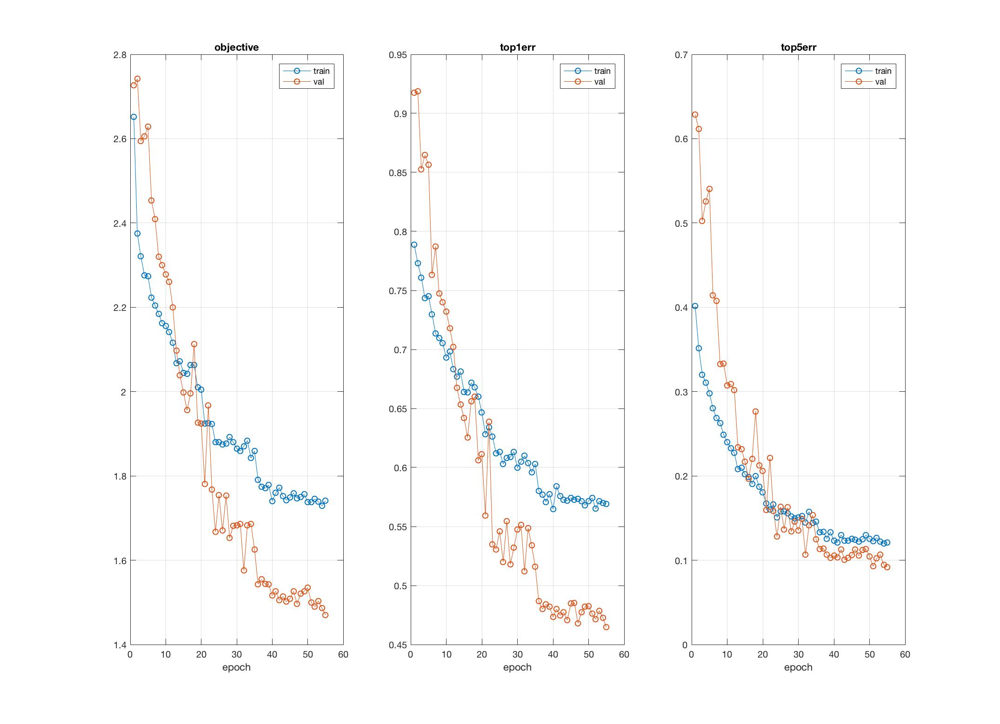
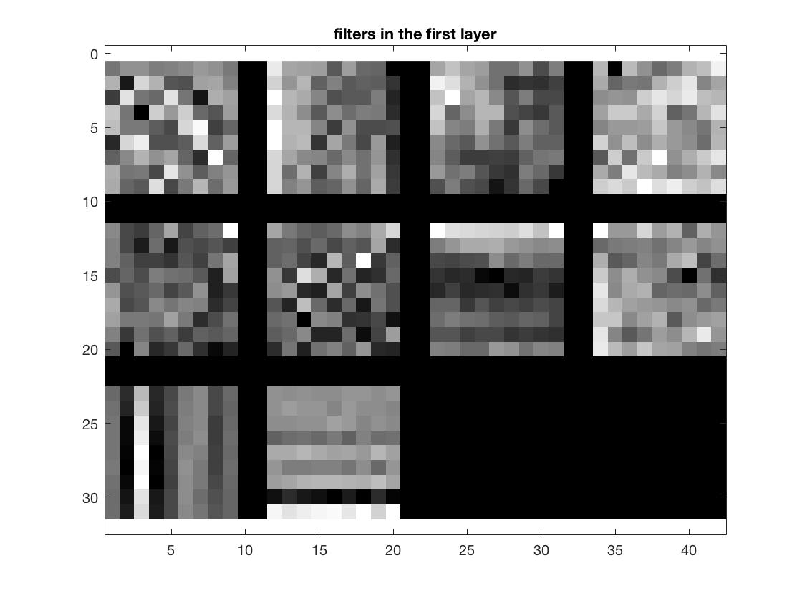
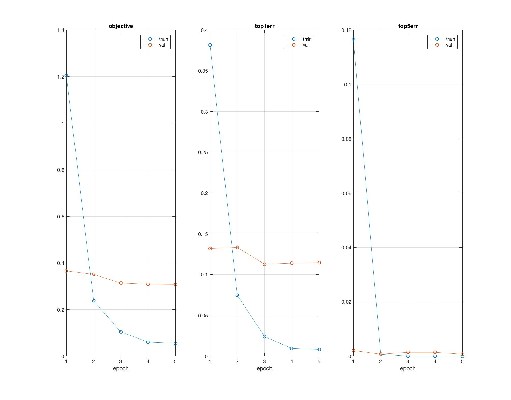

# Scene-Recognition-Deep-Learning
#### Note: Requires matconvnet-1.0-beta25

<html>
<head>
<title>Deep Learning Project</title>
<link href='http://fonts.googleapis.com/css?family=Nunito:300|Crimson+Text|Droid+Sans+Mono' rel='stylesheet' type='text/css'>
<link rel="stylesheet" title="Default" href="styles/github.css">

<link rel="stylesheet" href="highlighting/styles/default.css">

</head>
<body>

<h1>Aayush Kumar</h1>

<h2> Project 6 / Deep Learning</h2>

	In this project, i felt by far and large that I was able to learn a massive amount about deep learning and it's practical
	and performant applications in the context of computer vision.

	Extra Credit:
	<ul>
		<li>
			Augment dataset with Sun Data and train
		</li>
	</ul>

<h3>Part 1</h3>

I found part 1 to be massively insightful about how much little changes like Jittering data, even with something as simple as reflection.
Here I saw that the approach I used in the last project was not something that was specific to training with an svm classifier, but a technique that
is universally usable in all instances of image processing. Scenes and faces are not the only things that can be mirrored, off the top of my head I can think about how simple object recognition
can leverage something like this.

<h4>Problem 1: "jitter" training data.</h4>

I went ahead and implented a coin toss approach to flipping the images, where in a single iterative loop I check the modulo 2 of the randomly generated integer to decide if I should flip an image.

<pre><code>
function [im, labels] = getBatch(imdb, batch)
%getBatch is called by cnn_train.

%'imdb' is the image database.
%'batch' is the indices of the images chosen for this batch.

%'im' is the height x width x channels x num_images stack of images. If
%opts.batchSize is 50 and image size is 64x64 and grayscale, im will be
%64x64x1x50.
%'labels' indicates the ground truth category of each image.

%This function is where you should 'jitter' data.
% --------------------------------------------------------------------

im = imdb.images.data(:,:,:,batch) ;

[height, width, channels, num_images] = size(im);

for i = 1: num_images
    if (mod(round(rand * 10), 2) == 1)
        im(:,:,1,i) = fliplr(im(:,:,1,i));
    end
end

labels = imdb.images.labels(1,batch) ;

end

</code></pre>

<h4>
	Problem 2: The images aren't zero-centered.
</h4>

	To remedy the zero-centered issue, I simply took a running sum of all images while they are being processed in the very beginning and then divided it element wise by the image_counter variable.
	By doing so, I only have to resort to another added round of iteration through the images to subtract the mean image from each of them, something which I intentionally chose with the aim of a
	more performant runtime.

<h4>
	Problem 3: Regularizing the Network
</h4>

	To prevent extreme overfitting of our network's parameters to the training data and also make it more accomodating of the validation data, I added a dropout layer with a rate of 0.5.

<h4>
	Deepening the Network
</h4>

As per the suggestion of the instructions, I added a convolutional layer after the existing relu layer
with a 5x5 window and then a max-pool over a 3x3 window. In addition, I decreased the stride of the previous max-pool because
of the notion of how deep networks avoid overly lossy layers by subsampling no more than 2 or 3 each layer to a stride of 3.

<pre><code>
	net.layers{end+1} = struct('type', 'conv', ...
                           'weights', {{f*randn(9,9,1,10, 'single'), zeros(1, 10, 'single')}}, ...
                           'stride', 1, ...
                           'pad', 0, ...
                           'name', 'conv1') ;

net.layers{end+1} = struct('type', 'pool', ...
                           'method', 'max', ...
                           'pool', [7 7], ...
                           'stride', 3, ... % deep networks usually do not subsample by more than a factor of 2 or 3 each layer.
                           'pad', 0) ;

net.layers{end+1} = struct('type', 'relu') ;

net.layers{end+1} = struct('type', 'conv', ...
                           'weights', {{f*randn(5,5,1,10, 'single'), zeros(1, 10, 'single')}}, ...
                           'stride', 1, ...
                           'pad', 0, ...
                           'name', 'conv1') ;

net.layers{end+1} = struct('type', 'pool', ...
                           'method', 'max', ...
                           'pool', [3 3], ...
                           'stride', 2, ...
                           'pad', 0) ;

net.layers{end+1} = struct('type', 'dropout',...
                            'rate', 0.5);

net.layers{end+1} = struct('type', 'conv', ...
                           'weights', {{f*randn(6,6,10,15, 'single'), zeros(1, 15, 'single')}}, ...
                           'stride', 1, ...
                           'pad', 0, ...
                           'name', 'fc1') ;

</code></pre>

<h4>
	Increasing Learning Rate via Batch Normalization
</h4>

	Prior to batch normalization, I was sticking to the default initial learning rate of 0.0001.
	However, by adding two normalization layers after my first two conv layers I was able to use a learning rate of __.

	I later decided to use a nonlinear learning rate with decreases over time,
	as I realized that network can afford to be more aggressive initally.

<h4>Final Result: </h4>
Lowest validation error is 0.469333
1 - 0.47 = 53% test accuracy
Time: 5 minutes

	<h3>Results in a table: </h3>

	<table border=1>
		<tr>
			<td>
				
				
			</td>
		</tr>
	</table>

	<h4>Extra Credit - Augmenting Data Set with Sun Data</h4>

	<h5>
		Augmenting the Dataset
	</h5>
	

		To augment additional scene training data from the SUN database, I simply downloaded the database and combined certain categories into the scenes that I saw reasonably similar.
		The difference in labels was not that much of a hinderance, but it did lend itself to some problems later. For one, I was initially noticing that I wasn't getting very different
		results at first. This would prove to be the result of the default implementation of the image data selection code, which defaults to the first 100 images in any training data folder category.
	

<h5>
	Training the Augmented Dataset
</h5>
	

		Another issue after augmenting the Data Set with the Sun Data was that I realized that many of the categories had a disproportionate amount of training data.
		For instance, there were 1029 images of bedrooms whereas there were only 100 images in forest in the augmented dataset.
		Prior to any modifications, the CNN simply took the first 100 pictures in any label folder for training purposes.
		To actually leverage the new data that is introduced at the end of each label folder's contents, I incorporated a datasample of 100 images such that
		I would be able to get a good equily distributed representation of the combined dataset for training purposes.
		Lowest validation error is 0.464667 for when i did the nonlinear learning rate approach on the database when augmented with
		the sun data.

		I also found much better performance by removing all of my batch normalization layers and with the nonlinear learning rates and corresponding epochs below:
	

<pre>
	<code>
	opts.learningRate = [ones(1,10).*0.01, ones(1,10).*0.0001, ones(1,10).*0.00005, ones(1,10).*0.000001]
	opts.numEpochs = numel(opts.learningRate) ;
	</code>
</pre>

<h4>Final Result: </h4>
Lowest validation error is 0.464667
1 - 0.464667 = 54% test accuracy
Time: 8 minutes

<h3>Results in a table</h3>

<table border=1>
	<tr>
		<td>
			
			
		</td>
	</tr>
	</table>

<h3>Part 2</h3>

	Although I tweaked parameters like the bagkPropDepth, I found that as is the network was able to perform reasonably well, and thus left it alone.
	 However, at 10 epochs it consistently ran overtime.

<h5>
	Tweaking Epochs
</h5>

	Quite regularly would my code exceed ten 10 minute requirement- as a result I repeatedly fine tuned with smaller and smaller
	epochs again and again such that my training and validation would fall within the time threshold. Eventually I settled with
	3 epochs, as I began noticing that I convergerged fairly consistently to the

<h5>
	More Tweaking Epochs
</h5>

	After realizing the benefits of nonlinear learning rates from part 1, I decided to apply this idea to part 2 to see what results I would get.

<h4>Final Result: </h4>
Lowest validation error is 0.112667
1 - 0.112667 = 88.73% test accuracy
Time: 8 minutes

<h3>Results in a table</h3>

<table border=1>
	<tr>
		<td>
			
			
		</td>
	</tr>
</table>

</body>
</html>

### [Scene Recognition with Bag of Words + SVM](https://github.com/aayush-k/Scene-Recognition-BoWs)
Previous version of Scene Recognition done with Bag of Words model paired with multiple binary 1 vs all SVMs:
